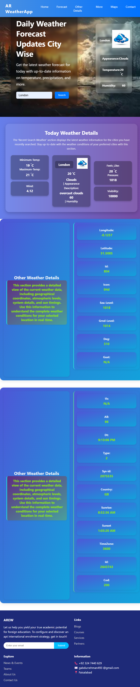

🌤️ AR Weather App

AR Weather App is a stylish and efficient weather forecasting web application that provides real-time, city-based weather updates. Built using HTML, CSS, and JavaScript, it delivers a user-friendly interface with visually rich components to view essential and advanced weather metric

📌 Features

🔍 City-wise real-time weather search

🌡️ Temperature, humidity, wind, pressure, visibility, and more

🗺️ Coordinates, sea level, ground level, and sunrise/sunset timings

🌈 Clean, modern UI with responsive layout

🧠 Easy navigation with multiple sections for details and forecast

🖼️ Weather icons and imagery for better UX

## 📸 Screenshots

📄 License

This project is licensed under the MIT License.
You are free to use, modify, and distribute this software in both personal and commercial projects with proper attribution.

📧 Contact

Created by AR Developer
Feel free to reach out for collaboration or feedback!
